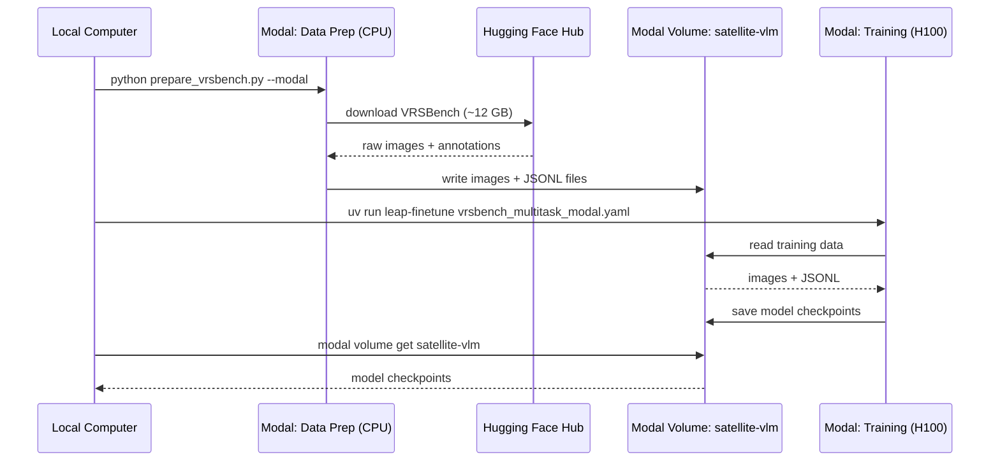

<Card title="View Source Code" icon="github" href="https://github.com/Liquid4All/cookbook/tree/main/examples/satellite-vlm">
  Browse the complete example on GitHub
</Card>

Fine-tune [LiquidAI/LFM2.5-VL-450M](https://huggingface.co/LiquidAI/LFM2.5-VL-450M) on satellite imagery tasks with Liquid AI's fine-tuning tooling and serverless GPUs.


## What's inside?

In this example, you will learn how to:

- **Fine-tune a vision-language model** using [leap-finetune](https://github.com/Liquid4All/leap-finetune/), Liquid AI's fine-tuning framework for LFM models
- **Run data preparation and training in the cloud** using [Modal](https://modal.com), without managing GPU infrastructure locally
- **Prepare satellite imagery data** from [VRSBench](https://huggingface.co/datasets/xiang709/VRSBench), a NeurIPS 2024 dataset with three task types:
  - **VQA**: answer questions about satellite images (123K QA pairs)
  - **Visual Grounding**: detect and localize objects with bounding boxes (52K references)
  - **Captioning**: generate detailed descriptions of satellite scenes (29K captions)

<Note>
  This workflow runs the heavy computation in the cloud. The local machine only launches jobs and streams logs, so no local GPU is required.
</Note>

## Environment setup

You will need:

- [uv](https://docs.astral.sh/uv/) to manage Python dependencies
- [Modal](https://modal.com) for serverless CPU and GPU jobs
- A [Hugging Face](https://huggingface.co/) account to download VRSBench
- Access to the [leap-finetune](https://github.com/Liquid4All/leap-finetune/) repository

## How to run it?

Start by cloning the cookbook repository and opening the example directory:

```bash
git clone https://github.com/Liquid4All/cookbook.git
cd cookbook/examples/satellite-vlm
```

### 1. Install and authenticate

Modal provides serverless GPUs you pay for per second. New accounts include free credits, enough to run this example end to end.

```bash
uv sync
uv run python -m modal setup
uv run huggingface-cli login
```

### 2. Prepare the data

Download and convert VRSBench inside a Modal container. The converted data is pushed to a Modal volume where the fine-tuning job will read it.

```bash
uv run python prepare_vrsbench.py --task all --modal
```

### 3. Clone leap-finetune and start training

Run the training job on an H100. Checkpoints are saved to the `satellite-vlm` Modal volume.

```bash
git clone https://github.com/Liquid4All/leap-finetune/
cd leap-finetune
uv sync
uv run leap-finetune ../configs/vrsbench_multitask_modal.yaml
```

<Check>
  At this point, Modal streams the training logs back to your terminal while the job runs remotely.
</Check>

## How it works

All heavy computation runs in the cloud. The only things that run locally are the `prepare_vrsbench.py` launcher and the `leap-finetune` CLI.

1. **Data prep (Modal CPU container):** `prepare_vrsbench.py --modal` downloads VRSBench (~12 GB) from Hugging Face, converts it to JSONL, and writes images and annotations to a Modal volume named `satellite-vlm`.
2. **Training (Modal H100):** `leap-finetune` submits a training job that reads data from the same volume, fine-tunes the model, and saves checkpoints back to the volume.
3. **Retrieval (local):** you pull checkpoints from the volume to your machine with `modal volume get`.



## Data preparation

`prepare_vrsbench.py` downloads VRSBench from Hugging Face and converts it to the JSONL format required by leap-finetune.

<Tabs>
  <Tab title="Modal (recommended)">
    Run entirely in the cloud and write directly to the `satellite-vlm` Modal volume:

    ```bash
    uv run python prepare_vrsbench.py --task all --modal
    ```
  </Tab>

  <Tab title="Local development">
    Run a single task or a limited sample count for quick iteration:

    ```bash
    uv run python prepare_vrsbench.py --task vqa --limit 500
    ```
  </Tab>
</Tabs>

Output files are written to `./data/` locally, or to the Modal volume with `--modal`:

- `vrsbench_{task}_train.jsonl`: training data
- `vrsbench_{task}_eval.jsonl`: evaluation data

## Training

Run from the `leap-finetune` root, cloned during the quickstart:

```bash
uv run leap-finetune ../configs/vrsbench_multitask_modal.yaml
```

The job runs on an H100, streams logs to your terminal, and saves checkpoints to the `satellite-vlm` Modal volume under `/satellite-vlm/outputs/`.

<Note>
  To enable experiment tracking, uncomment `tracker: "wandb"` in the config.
</Note>

## Retrieving checkpoints

List and download checkpoints from the Modal volume:

```bash
modal volume ls satellite-vlm outputs/
modal volume get satellite-vlm /satellite-vlm/outputs/<run-name> ./outputs
```

## Data format

The grounding task uses JSON bounding box format with 0-1 normalized coordinates, matching the LFM VLM pretraining format:

```text
User:      Inspect the image and detect the large white ship.
           Provide result as a valid JSON:
           [{"label": str, "bbox": [x1,y1,x2,y2]}, ...].
           Coordinates must be normalized to 0-1.

Assistant: [{"label": "ship", "bbox": [0.37, 0.00, 0.80, 0.99]}]
```

VQA and captioning use standard question-answer format with no special structure.

## Evaluation

Benchmarks run automatically during training at every `eval_steps`:

- **VQA**: `short_answer` metric (case-insensitive substring match)
- **Grounding**: `grounding_iou` metric (IoU@0.5 threshold)
- **Captioning**: `CIDEr` or `BLEU` metrics

Each eval dataset can be limited, for example to 500 samples, via the `limit` field in the YAML config for faster iteration.

<Accordion title="Run a full standalone evaluation">
  To evaluate on the complete dataset without retraining, use `configs/vrsbench_full_eval.yaml`.

  Set `eval_on_start: true`, remove the `limit` fields, and point the config at your checkpoint path. The model runs the full evaluation at step 0, logs results to WandB, and terminates.
</Accordion>

## AI in Space Hackathon

This example is the official starting point for the [AI in Space Hackathon](https://luma.com/n9cw58h0), a fully online event organized in partnership between [DPhi Space](https://github.com/DPhi-Space/SimSat) and Liquid AI, open to builders from around the globe.

Use this fine-tuning pipeline as your baseline and push it further with real satellite data.

[](https://luma.com/n9cw58h0)

<CardGroup cols={2}>

<Card title="Register for the Hackathon" icon="satellite" href="https://luma.com/n9cw58h0">
  Join the AI in Space Hackathon and build with satellite AI.
</Card>

<Card title="Join our Discord" icon="discord" iconType="brands" href="https://discord.gg/DFU3WQeaYD">
  Connect with the community and ask questions about this example.
</Card>

</CardGroup>
